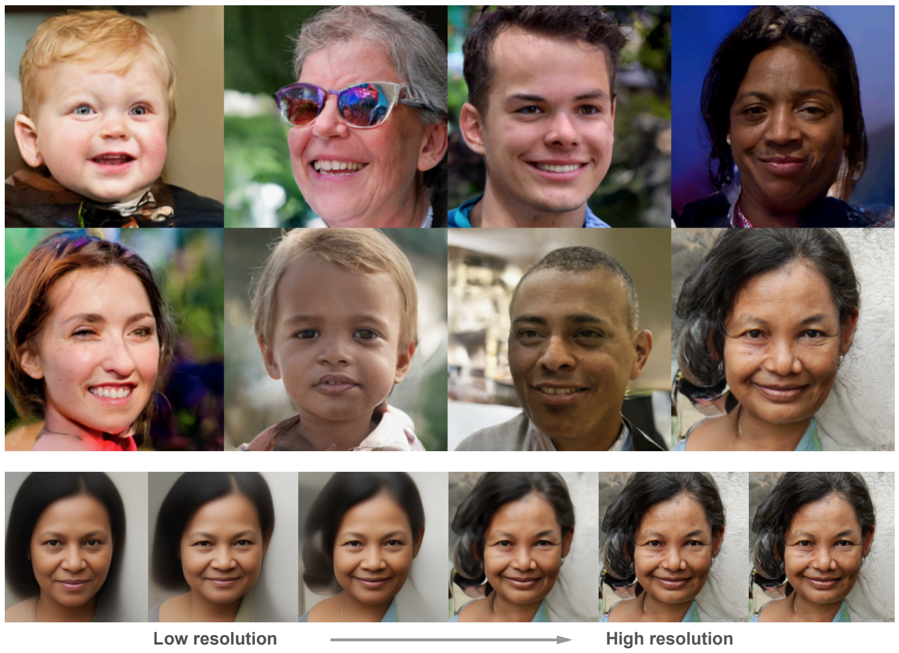

# Very Deep VAEs in JAX/Flax
Implementation of the experiments in the paper [_Very Deep VAEs Generalize Autoregressive Models and Can Outperform Them on Images_](https://arxiv.org/abs/2011.10650) using [JAX](https://github.com/google/jax) and [Flax](https://github.com/google/flax), ported from the [official OpenAI PyTorch implementation](https://github.com/openai/vdvae).

I have tried to keep this implementation as close as possible to the original. I was able to re-use a large proportion of the code, including the data input pipeline, which still uses PyTorch. I recommend installing a CPU-only version of PyTorch for this.

Tested with JAX 0.2.10, Flax 0.3.0, PyTorch 1.7.1, NumPy 1.19.2. I also ran training to convergence on cifar10 on cloud TPU, and reproduced the test ELBO value of 2.87 from the paper, using `--conv_precision=highest`, see below. If anyone asks for trained checkpoints for cifar I will be happy to upload them.

From the paper, some model samples and a visualization of how it generates them:



# Setup
As well as JAX, Flax, NumPy and PyTorch, this implementation depends on [Pillow](https://pillow.readthedocs.io) and [scikit-learn](https://scikit-learn.org):
```
pip install pillow
pip install sklearn
```
Also, you'll have to download the data, depending on which one you want to run:
```
./setup_cifar10.sh
./setup_imagenet.sh imagenet32
./setup_imagenet.sh imagenet64
./setup_ffhq256.sh
./setup_ffhq1024.sh  /path/to/images1024x1024  # this one depends on you first downloading the subfolder `images_1024x1024` from https://github.com/NVlabs/ffhq-dataset on your own & running `pip install torchvision`
```

# Training models
Hyperparameters all reside in `hps.py`.
```bash
python train.py --hps cifar10
python train.py --hps imagenet32
python train.py --hps imagenet64
python train.py --hps ffhq256
python train.py --hps ffhq1024
```

# TODOs
- Implement support for 5 bit images which was used in the paper's FFHQ-256 experiments. 

# Known differences from the orignal
 - Instead of using the PyTorch default layer initializers we use
   the Flax defaults.
 - Renamed rate/distortion to kl/loglikelihood.
 - In multihost configurations, checkpoints are saved to disk on all hosts.
 - Slight changes to DMOL loss.

# Things to watch out for
We tried to keep this implementation as close as possible to the author's [original Pytorch implementation](https://github.com/openai/vdvae). There are two potentially confusing things which we chose to preserve. Firstly, the `--n_batch` command line argument specifies the _per device_ batch size; on configurations with multiple GPUs/TPUs and multiple hosts this needs to be taken into account when comparing runs on different configurations. Secondly, some of the default hyperparameter settings in `hps.py` do not match the settings used for the paper's experiments, which are specified on page 15 of the paper.

In order to reproduce results from the paper on TPU, it may be necessary to set `--conv_precision=highest`, which simulates GPU-like float32 precision on the TPU. Note that this can result in slower runtime. In my experiments on cifar10 I've found that this setting has about a 1% effect on the final ELBO value and was necessary to reproduce the value 2.87 reported in the paper.

Finally, we found it necessary to raise the `--skip_threshold` parameter to avoid training occasionally getting stuck, due to consistently large magnitude gradients. The default value for cifar10 is 400, raising it to 1000 seems to solve any stuck training issues.

# Acknowledgements
This code is very closely based on [Rewon Child](https://github.com/rewonc)'s implementation, thanks to him for writing that. Thanks to [Julius Kunze](https://github.com/JuliusKunze) for tidying the code and fixing some bugs.
